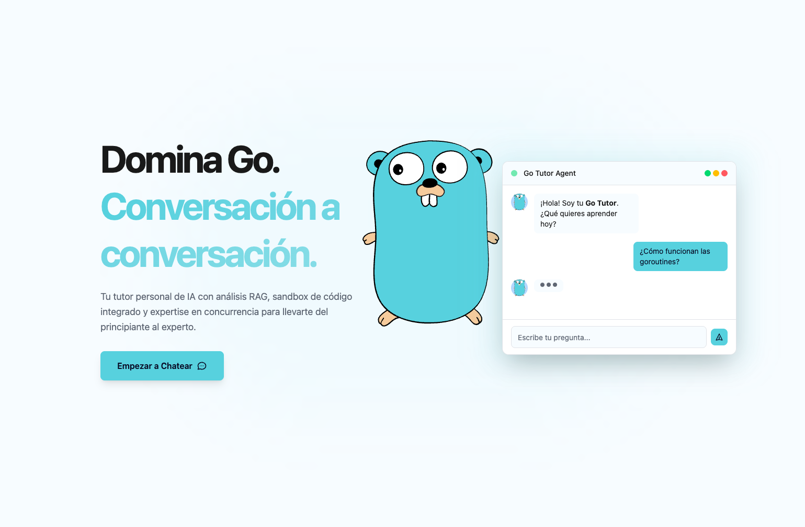

# Hi there, I'm José Carlos 👋

  

## 🛠️ Tech Stack
  

  
### Core Technologies

  
    &nbsp;&nbsp;&nbsp;&nbsp;
  
    &nbsp;&nbsp;&nbsp;&nbsp;
  
    &nbsp;&nbsp;&nbsp;&nbsp;
  
    &nbsp;&nbsp;&nbsp;&nbsp;
  
    &nbsp;&nbsp;&nbsp;&nbsp;
  
    &nbsp;&nbsp;&nbsp;&nbsp;
  
    &nbsp;&nbsp;&nbsp;&nbsp;
  
  &nbsp;&nbsp;&nbsp;&nbsp;
  

 

### DevOps & Tools

  
  &nbsp;&nbsp;
  
  &nbsp;&nbsp;&nbsp;&nbsp;
  
      &nbsp;&nbsp;&nbsp;&nbsp;
  
      &nbsp;&nbsp;&nbsp;&nbsp;
  
      &nbsp;&nbsp;&nbsp;&nbsp;
  

  
  

 

### Currently Learning

  
    &nbsp;&nbsp;&nbsp;&nbsp;
  
    &nbsp;&nbsp;&nbsp;&nbsp;
  
    &nbsp;&nbsp;&nbsp;&nbsp;
  
    &nbsp;&nbsp;&nbsp;&nbsp;
  
  

---

## 🌟 Featured Projects

##  [ **Go Tutor Agent**](https://github.com/JosCarRub/go-tutor-agent-project)

*An intelligent tutoring system for Go programming language*

  
  
<em>Comprehensive microservices architecture for interactive Go programming education</em>

 

The system is orchestrated with Docker and is composed of:
- **Backend:** A robust REST API with **Spring Boot** and data persistence in **MongoDB**.  
- **AI Core:** The agent's brain, built with **Python** and **FastAPI**. 
- **Code Sandbox:** A dedicated microservice in **Go** for secure, isolated executions. 
- **Frontend:** An ultra-fast UI with **Astro** and **Preact** (Islands Architecture). 
- **Observability:** A complete stack with **Prometheus, Grafana, and Loki** for comprehensive monitoring.  

[👨‍💻 **Go Tutor Agent**](https://github.com/JosCarRub/go-tutor-agent-project)

---

  
  
  

